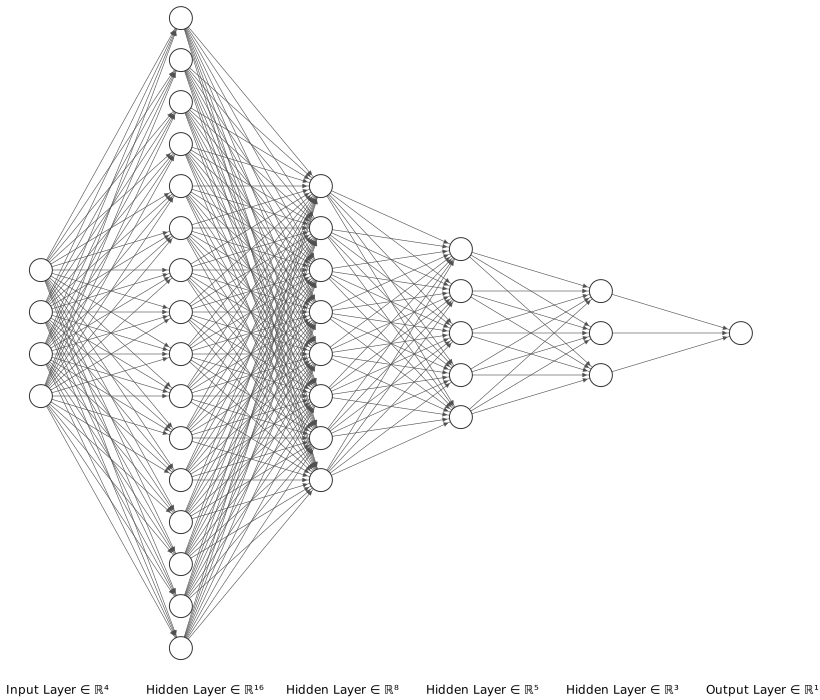
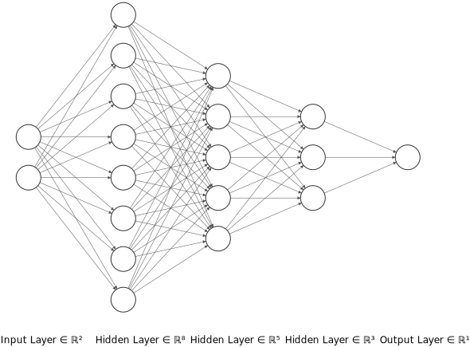

# Neural network quadraphonic upmix
### Stereo content demixing and ideas behind the topic

A neural network approach to stereo audio content upmix is extremely simple given a well-labelled dataset. Upmixer converts the stereo audio signal to multichannel, this article is not intended to build an N-channels upmixer, instead, author like to demonstrate the source separation current state-of-the-art upmixer that author involved.

## Method & Implementation

Stereo upmix is a process to demix directional components from 2 channels mixture. The neural network is operated on Short-time Fourier transform bins.

Author had conduct two test with different number of neurons = [4,16,8,5,3,1] and [2,8,5,3,1] respectively, network parameters of the network were chosen empirically, all layers use ReLU as activation function.

### NN1

**NN1** use end-to-end input learning, the training processing force neural network to figure out the relationship between two complex numbers.

Input vector for **NN1**:

### NN2

**NN2** learn feature already extracted.

Input vector **NN2**:

## Analysis
* An extra hidden layer was added to **NN1**, which avoid model underfitting, also, lead author assume the first layer act as a feature extractor, we have no actual proof that the network is using its first layer as I intend.
* Experiments shown last hidden layer control the transition of the stereo audio panning mask function.

Among end-to-end learning characteristics are:

* Straightforward.
* CPU intense, offen require more network parameters to fit the data.
* Models are prone to underfit if bad training data were used.

Compare with **James Fung & Joseph Young 2017** algorithm:

* Neural network implementation doesn't require substantial knowledge of stereo signal model, it is data-driven.
* Extend to N-channels upmix is somehow not easy for neural network, labelling directional sound components isn't that simple.
* **James Fung & Joseph Young 2017** is angle directional based, which allow arbitrary sound source blending with just stereo input.
* Matrix multiplication isn't that fast, suppose we need to run upmixer on hardware.
* Perfect reconstruction downmix were both available, but **James Fung & Joseph Young 2017** provide extra spatial enhancement mode, might suit for varies applications.

Major advantages of neural network upmix:

* Simple
* Most panning technique used in studio can be successfully demixed, including amplitude pan, in/out of phase panning, or complicated audio scene like reverb. Some prior arts can only demix some of panning technique, which is very insufficient for current commercial music recordings.
* Perfect reconstruction downmix

## Upmixers benchmark
#### Objective: Given p1(n) p2(n) p3(n) are mixed into stereo signal [x1(n) x2(n)], demix p1(n) p2(n) p3(n) from [x1(n) x2(n)]

### Compare signal similarity to ground truth signals
The neural network upmix cannot surpass author involved state-of-the-art upmix algorithm, but still producing quite decent result, especially for **NN2**.

## Training
Real life audio data was used in neural network training, including, but not limited to, studio recordings, artifical sound at reverberant environment.

However, not all microphone and ADC records full hearing range, even 18k cut-off is considered to contaminate my training data, so, training data will be collected from < 15.5 kHz which is about the same as 128 kbps MP3 cut-off point.

## What's difference between neural network prior art[1] and this method?
No contextual information used in my implementation, which may lead to higher artefacts(Musical noise) in **NN2** output, parameters are adjusted to fit my datasets. But however, no context frame == lower latency, <21.34 ms was achieved.

## Reference
[1] Ibrahim, Karim & Allam, Mahmoud. (2018). Primary-Ambient Source Separation for Upmixing to Surround Sound Systems. 10.1109/ICASSP.2018.8461459.